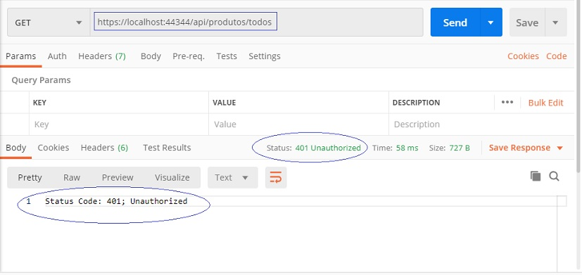
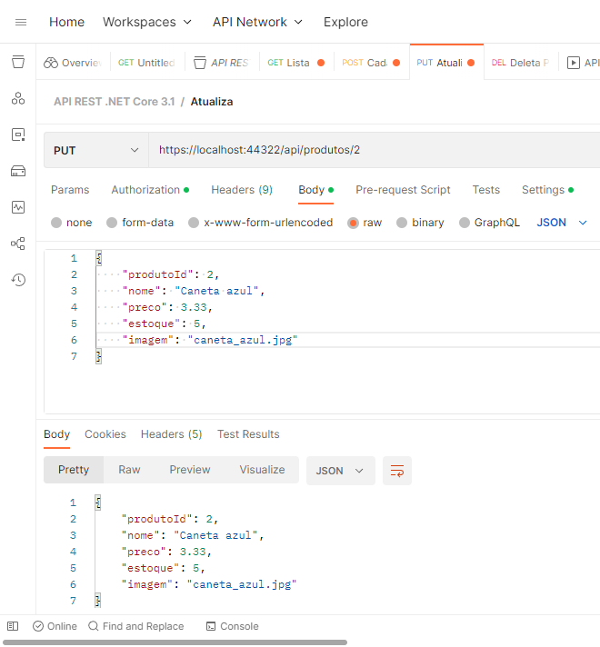
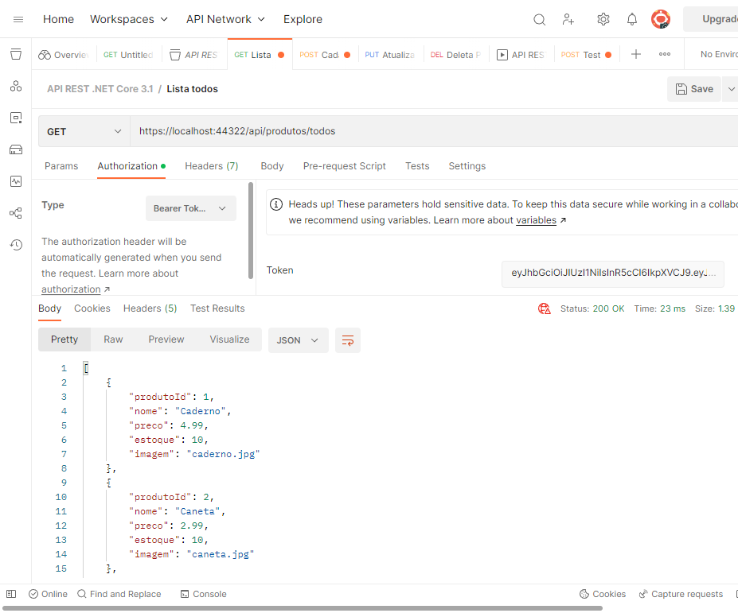
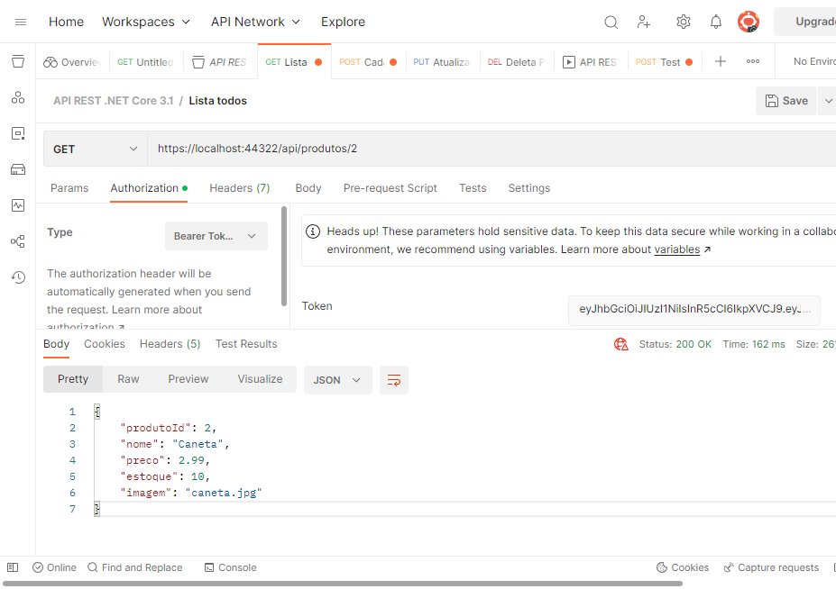
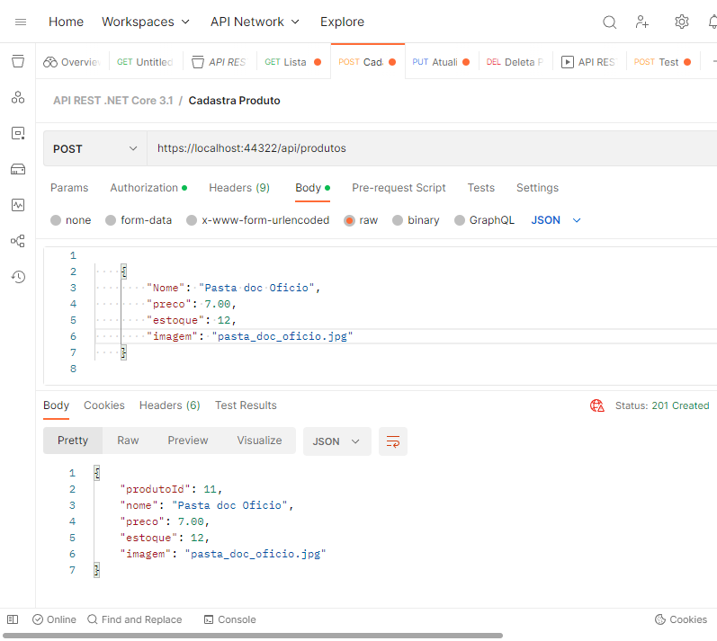
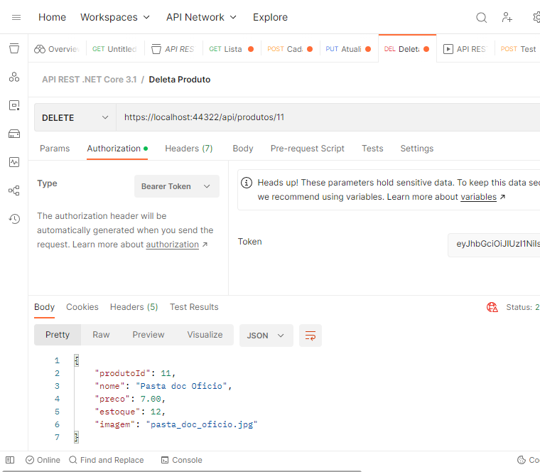

# Inventario-Restful-API
ASP.NET Core 3.1 - CRUD : Web API com EF Core e Tokens JWT

<p align="center"></p>

## ✨ Tecnologias

Esse projeto foi desenvolvido com as seguintes tecnologias:
- **Banco de Dados**: [MS SQL Server 2022](https://www.microsoft.com/pt-br/sql-server/sql-server-2022)
- **IDE de desenvolvimento**: [MS Visual Studio 2022](https://visualstudio.microsoft.com/pt-br/vs/)
- [ASP.NET](https://dotnet.microsoft.com/apps/aspnet/)
- [JWT Tokens](https://jwt.io/)
- [EF Core 3.1](https://docs.microsoft.com/en-us/ef/core/)

## Conceitos abordados:
### API
(Interface de Programação de Aplicações) é um conjunto de padrões e protocolos que integram um usuário a uma aplicação, permitindo que ele acesse e faça uso das funcionalidades do software em questão.

### REST
(Transferência de Estado Representacional) é um tipo de arquitetura de software. Uma REST, na prática, é um conjunto de restrições que devem ser seguidas no desenvolvimento de uma aplicação na internet.

### APIs REST
<p>Podem ser baseadas no protocolo HTTP (não obrigatório) e fornecem aos aplicativos a capacidade de se comunicar usando o formato JSON, sendo executadas em servidores web.</p>
<p>O estilo arquitetural REST que vamos considerar é representado pelas seguintes entidades:</p>
-**Resource**: Os recursos são entidades identificáveis de forma única ​​(por exemplo: dados de um banco de dados, imagens ou qualquer dado). Qualquer informação que pode ser nomeada pode ser um recurso.
-**Endpoint**: É um recurso pode ser acessado através de um identificador de URL;
-**Resource Method**: vamos considerar o método HTTP como sendo o tipo de solicitação que um cliente envia para um servidor web. Os principais métodos HTTP usados nas APIs REST criadas na plataforma .NET são:  GET, POST, PUT e DELETE. 
-**Header HTTP**: Um cabeçalho HTTP é um par de chave-valor usado para compartilhar informações adicionais entre um cliente e servidor, como:
--Tipo de dados que estão sendo enviados ao servidor (JSON, XML);
--Tipo de criptografia suportada pelo cliente;
--Token relacionado à autenticação;
--Dados do cliente com base na necessidade do aplicativo;
--Formato de dados JSON: é um formato comum para enviar e receber dados por meio de APIs REST;


## 💻 Projeto

O projeto é uma implementação de uma API de inventário feita com .NET Core, JWT (JSON Web Token) e Entity Framework Core 3.1 


#### GET - Tentando retornar produtos sem o token:
<p></p>

#### Atualiza um registro identificado pelo id recebido:
<p></p>

```
         // Atualiza um registro identificado pelo id recebido
        [HttpPut("{id}")]
        public async Task<IActionResult> PutProduto(int id, Produto produto)
        {
            if(id != produto.ProdutoId)
            {
                return BadRequest($"O código do produto {id} não confere.");
            }

            try
            {
                await repository.Update(id, produto);
            }
            catch
            {
                throw;
            }

            return Ok(produto);
        }
```

#### Rota api/produtos Permite acesso anônimo ou seja sem autenticação 
<p></p>
```
        // AllowAnonymous – Permite acesso anônimo ou seja sem autenticação
        [AllowAnonymous]
        [HttpGet]
        public ActionResult<string> Get()
        {
            // retornando apenas a data do acesso atual
            return "ProdutosController :: Acessado em: " + DateTime.Now.ToLongDateString();
        }
```

#### GET - Retornando todos produtos com autenticação (usuário previamente cadastrado na base de dados e token válido): 
<p></p>
```
        // Authorize(Roles=”Perfil1,Perfil2”) – Exige que o usuário esteja autenticado e que faça parte de um dos perfis definidos.
        [HttpGet("todos")]
        public async Task<ActionResult<IEnumerable<Produto>>> GetProdutos()
        {
            var produtos = await repository.GetAll();

            if (produtos == null)
            {
                return BadRequest("Produtos é null");
            }

            return Ok(produtos.ToList());
        }
```

#### GET - Retornando produto pelo id: 
<p></p>
```
        // Retornando produto pelo Id recebido
        [HttpGet("{id}")]
        public async Task<ActionResult<Produto>> GetProduto(int id)
        {
            var produto = await repository.GetById(id);

            if(produto == null)
            {
                return NotFound("O id informado não corresponde a nenhum produto cadastrado.");
            }

            return Ok(produto);
        }
```

#### POST - cadastrando produto: 
<p></p>
```
        // POST api/<controller>
        // No método POST estamos retornando um código de status 201 gerado pelo método CreatedAtAction quando um produto for criado.
        [HttpPost]
        public async Task<IActionResult> PostProduto([FromBody]Produto produto)
        {
            if(produto == null)
            {
                return BadRequest("Produto é null");
            }

            await repository.Insert(produto);

            return CreatedAtAction(nameof(GetProduto), new { Id = produto.ProdutoId }, produto);
        }
```

#### DELETE - Apagando produto pelo id: 
<p></p>
```
        [HttpDelete("{id}")]
        public async Task<ActionResult<Produto>> DeleteProduto(int id)
        {
            var produto = await repository.GetById(id);

            if(produto == null)
            {
                return NotFound($"Produto de {id} não foi encontrado");
            }

            await repository.Delete(id);

            return Ok(produto);
        }
    }
```

## 🚀 Como executar

- Clone o repositório
- Instale as dependências com `dotnet restore`
- Inicie o servidor com `dotnet watch run`


---

Feito por **Paulo E. Caetano dos Anjos**
